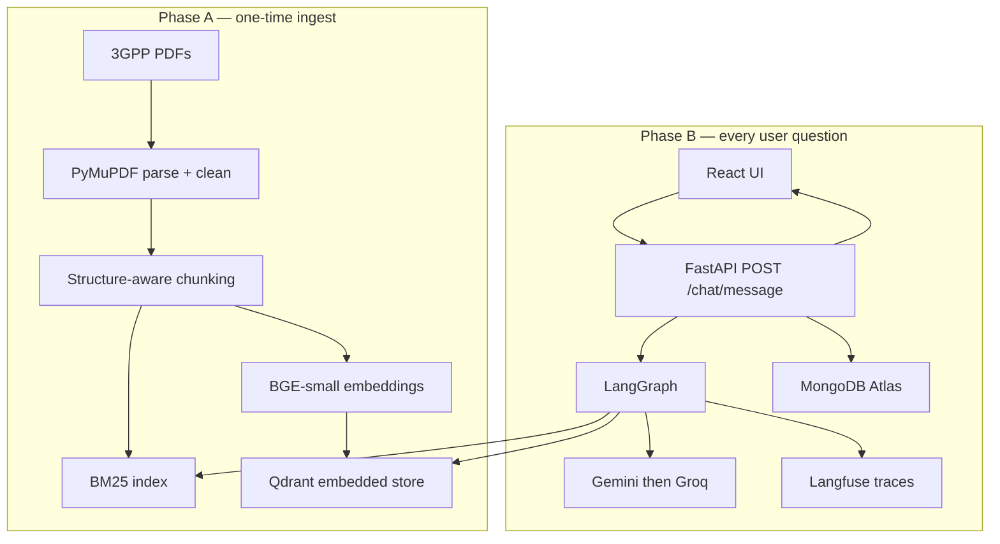

# 3GPP Standards Copilot — Project Design

This document describes **how the system is designed**, not how to install it. For setup and demo notes see [README.md](../README.md) and [PRESENTATION.md](PRESENTATION.md).

---

## 1. Product and design goal

**Product:** an evidence-grounded question-answering copilot over four Release-18 3GPP specifications (TS 23.501, 23.502, 24.501, 38.300).

**Primary design goal:** near-zero hallucination. The system is allowed to answer only when retrieved 3GPP passages support the claim. Otherwise it **abstains** with a fixed sentence:

> I don't have sufficient evidence in the available 3GPP documentation to answer this question.

That goal drives every major choice: structure-aware chunking, hybrid retrieval, a numeric evidence gate, citation ownership in Python (not the LLM), and a deterministic LangGraph workflow instead of an open-ended agent.

**Non-goals:** general web search, live 3GPP portal crawling, other releases unless ingested, authentication, and replacing a human reading the official PDF.

---

## 2. Design principles

1. **Abstain is success.** An unsupported answer is a worse failure than a refusal.
2. **Inspectable control, not prompt hope.** The evidence gate is a function on rerank scores. It does not ask the LLM “are you sure?”
3. **The model does not own citations.** The LLM returns `chunk_id` values. Python maps those IDs to specification, section, and page from stored metadata.
4. **Deterministic orchestration.** LangGraph is a state machine with fixed nodes and conditional edges. There is no tool-calling loop that can invent extra steps.
5. **3GPP structure is first-class.** Tables, numbered procedures, and headings must survive ingestion. The Table of Contents must not become “evidence.”
6. **Degrade gracefully.** Chat works if MongoDB Atlas or Langfuse is unavailable. Retrieval indexes live on disk independently of conversation history.

---

## 3. High-level architecture

Two phases, two runtimes.



| Layer | Responsibility |
|---|---|
| React + Vite | Chat UX, evidence badges, citation expansion |
| FastAPI | HTTP API, CORS, orchestration entry |
| LangGraph | Classify → retrieve → rerank → gate → generate → verify → finalize |
| Qdrant + BM25 | Hybrid candidate generation |
| Cross-encoder | Rerank top candidates; scores feed the gate |
| Gemini / Groq | Classification, grounded JSON generation, optional entailment |
| MongoDB Atlas | Conversation and message persistence |
| Langfuse | Optional per-node traces |

MongoDB is **not** on the retrieval path. Qdrant + BM25 are the knowledge indexes.

---

## 4. Runtime request path

```text
User question
  → POST /chat/message { query, conversation_id? }
  → load last 8 turns (if any)
  → LangGraph.invoke
       classify_query
         OUT_OF_DOMAIN → abstain → END
         IN_DOMAIN / AMBIGUOUS → retrieve → rerank → evidence_gate
              insufficient → finalize (abstain)
              sufficient  → generate → verify
                   first structural failure → generate once more
                   else → finalize
  → persist assistant message
  → JSON: answer, status, evidence_strength, citations, retrieved_chunks, latency_ms
```

Follow-ups are rewritten to a standalone question during classification so retrieval does not depend on anaphora (“what about SMF?” after an AMF question).

---

## 5. Ingestion design

Ingest is **offline** (`backend/scripts/ingest_documents.py`). The API does not parse PDFs on each question.

### 5.1 PDF parse and noise removal

- **PyMuPDF** extracts text with font name, size, and coordinates.
- Repeating ETSI / 3GPP header and footer lines are stripped.
- Cover pages, legal boilerplate, and the **Table of Contents** are skipped. Indexing starts at clause **1 Scope**.

ToC leakage is treated as a correctness bug: a ToC line can match almost any query and would look like “high relevance” junk.

### 5.2 Section detection

3GPP headings are typically Helvetica at ≥ 11 pt. Clause number and title often sit on **separate lines**; the parser merges them.

A body sentence such as “as described in clause 5.2.3” (Times-Roman ~10 pt) is **not** a heading. Heading detection combines:

- heading font flag
- section-number or Annex regex
- ToC dotted-leader rejection

### 5.3 Structure-aware chunking

Naive fixed-size splits destroy this corpus. Chunk types:

| Type | Rule |
|---|---|
| `prose` | Sentence-aware split, target ~1400 characters, overlap 180 |
| `table` | `Table x.y-z:` plus rows stay in one object |
| `figure` | Caption only; diagram label salad is dropped |
| procedures | Numbered `1. 2. 3.` lists are kept as atomic blocks |

Each chunk stores:

`chunk_id`, `text`, `chunk_type`, `specification`, `release`, `version`, `section`, `section_title`, `parent_section`, `page`, `source_filename`

`chunk_id` is a stable hash of identity fields so re-ingest is deterministic.

### 5.4 Index outputs on disk

| Artifact | Role |
|---|---|
| `data/processed/chunks.json` | Canonical chunk store |
| `data/processed/documents.json` | Spec metadata and chunk counts |
| `data/processed/bm25_index.pkl` | Keyword index |
| `data/qdrant/` | Embedded Qdrant collection `3gpp_chunks` |

**Constraint:** embedded Qdrant is a single-process file lock. Stop the API before re-ingesting, or run Qdrant as a Docker server (`QDRANT_MODE=server`).

---

## 6. Retrieval design

3GPP text is dense with **exact identifiers** (`AMF` vs `SMF`, `N1` vs `N2`, `23.501`). Dense embeddings blur those tokens; BM25 does not.

```text
query
  → embed with BAAI/bge-small-en-v1.5
  → Qdrant top-10  ─┐
  → BM25 top-10    ─┴→ RRF (k=60) → ~20 unique chunks
  → BAAI/bge-reranker-base → top-5, scores in [0, 1]
```

**RRF** (Cormack et al., 2009): for each list, a document at rank `r` contributes `1 / (k + r)` with `k = 60`. Fusion is by `chunk_id`. Vector and BM25 scores are preserved on the merged object for debugging.

**Why small embeddings:** `bge-large` made laptop ingest impractical. `bge-small` is a deliberate latency/quality tradeoff; the cross-encoder recovers ranking quality on the shortlist.

---

## 7. Evidence gate (hallucination control)

After rerank, **before generate**, `assess_evidence(scores)` decides whether generation is allowed.

```text
sufficient  =  top_score ≥ EVIDENCE_THRESHOLD
            AND  count(score ≥ SECONDARY_THRESHOLD) ≥ MIN_CHUNKS

strength    =  high    if top ≥ threshold + 0.15 and ≥ 2 supporting chunks
            |  medium  if sufficient
            |  low     otherwise  → abstain, skip LLM generate
```

Defaults: threshold `0.42`, secondary `0.28`, min chunks `1`.

This is **not** an LLM judge. The reasoning string is logged and returned to the UI / Langfuse so a reviewer can see the numbers.

Calibration (`scripts/calibrate_evidence_gate.py`) compares answerable vs unanswerable top-score distributions. Prefer a **higher** threshold (more abstention) if the two distributions overlap.

---

## 8. LLM and prompt strategy

| Role | Who | Contract |
|---|---|---|
| Classify | LLM | JSON: `IN_DOMAIN` / `OUT_OF_DOMAIN` / `AMBIGUOUS` + standalone rewrite |
| Generate | LLM | JSON: `{ answer, claims: [{ claim, chunk_ids }] }` — **no spec/section/page** |
| Verify (structural) | Python | Unknown `chunk_id` → fail |
| Verify (entailment) | LLM | Claim vs paired passage; paraphrase allowed |
| Citation labels | Python | `citation_from_chunk()` only |

**Provider chain:** configured Gemini model → other Gemini IDs → Groq `llama-3.3-70b-versatile` if a real key is set. 404/429 on one model should not kill the request if a fallback is configured.

**Why the LLM must not emit spec labels:** early versions invented `TS 23.501` / wrong pages even when the supporting chunk was correct. Ownership of public citations moved to `app/rag/citations.py`.

Generate style constraints (lead summary, bullets, ~100–180 words) are **orthogonal** to grounding rules. Style never relaxes “only use supplied chunks.”

---

## 9. LangGraph workflow

Implemented in `backend/app/rag/graph.py` as a compiled `StateGraph`.

| Node | Failure behavior |
|---|---|
| `classify_query` | `OUT_OF_DOMAIN` → `abstain` (no retrieve) |
| `retrieve` | Hybrid search into state |
| `rerank` | Cross-encoder; top-k into state |
| `evidence_gate` | Insufficient → set abstain text, skip generate |
| `generate` | Evidence-only JSON |
| `verify` | Bad `chunk_id`s → one regenerate, then abstain |
| `finalize` | Normalize status, timings, public fields |
| `abstain` | Classifier short-circuit |

State (`GraphState`) carries query, standalone query, chunks, assessment, claims, citations, status, and per-node timings. Status values exposed to the API: `grounded` | `abstained` | `error`.

---

## 10. API and frontend contract

FastAPI app title: **3GPP Standards Copilot**.

| Method | Path | Purpose |
|---|---|---|
| GET | `/health` | Process liveness; Qdrant / Mongo flags |
| GET | `/documents` | Indexed specs and chunk counts (sidebar) |
| POST | `/chat/message` | Main Q&A |

Request:

```json
{ "query": "What is the role of the SMF?", "conversation_id": null }
```

Response (abridged):

```json
{
  "conversation_id": "uuid",
  "answer": "...",
  "status": "grounded",
  "evidence_strength": "high",
  "citations": [
    { "specification": "23.501", "section": "6.2.2", "page": 144, "supporting_chunk_id": "...", "excerpt": "..." }
  ],
  "retrieved_chunks": [],
  "classification": "IN_DOMAIN",
  "latency_ms": 42980,
  "evidence_reasoning": "top_rerank=... threshold=..."
}
```

The UI renders:

- markdown answer
- pills: evidence strength, grounded/abstained, in-domain, latency
- citation badges `TS 23.501 §… p.…`
- expandable retrieved passage
- a distinct abstention panel (not a normal “answer” bubble)

CORS is limited to the Vite origin (`localhost:5173`).

---

## 11. Persistence design

**MongoDB Atlas** (async `motor`), database name from `MONGODB_DB_NAME`.

| Collection | Contents |
|---|---|
| `conversations` | Thread id, title, timestamps |
| `messages` | `role`, query/answer, `status`, `evidence_strength`, `citations`, `retrieved_chunks`, `created_at` |

If Atlas TLS or network fails, the process **disables Mongo for that run** and keeps history in memory. Indexes in `data/qdrant` and `chunks.json` are unaffected. Restarting uvicorn without Atlas **loses RAM history only**.

---

## 12. Observability design

Langfuse is optional. Missing keys → one warning, normal answers.

When enabled, each graph run is a trace (project `3gpp-rag`) with spans matching node names. The **evidence_gate** span is the demo artifact: input scores / output decision and ~millisecond local latency, distinct from end-to-end LLM time.

The API also returns `latency_ms` for the full request so the UI does not depend on Langfuse.

---

## 13. Evaluation and testing design

| Mechanism | What it measures |
|---|---|
| `backend/tests/` | Chunking (ToC skip, tables, figures, procedures), RRF, BM25 tokens, gate math, OOD abstain without generate, citation ID checks — **no model download** |
| `evaluation/questions.json` | Answerable, unanswerable-in-domain, out-of-domain, adversarial, multi-document |
| `scripts/evaluate.py` | Abstention accuracy, citation accuracy when expected spec is known, verify pass rate, average / P95 latency |
| `scripts/calibrate_evidence_gate.py` | Score gap between answerable and unanswerable |

Reported numbers must come from these tools. The design does not invent a single “accuracy %” as a product claim.

---

## 14. Module map

```text
backend/app/
  api/            HTTP routes
  core/           settings, logging
  ingestion/      PDF, sections, chunker
  retrieval/      embeddings, Qdrant, BM25, hybrid, reranker
  rag/            graph, prompts, LLM client, citations, nodes/*
  database/       Atlas client + conversation repo
  observability/  Langfuse
  services/       chat + documents + evaluation orchestration
  models/         Pydantic contracts

frontend/src/
  pages/ChatPage.tsx
  components/     MessageBubble, CitationBadge, EvidenceStrengthBadge, AbstentionNotice, MarkdownAnswer
  services/api.ts
```

---

## 15. Failure modes the design accepts

| Mode | Handling |
|---|---|
| Out-of-domain question | Classify → abstain |
| In-domain but missing from the four PDFs | Gate or verify → abstain |
| Adversarial fake clause (§99.1) | No matching chunk / gate fail → abstain |
| LLM invents a `chunk_id` | Structural verify fails → regenerate once → abstain |
| LLM invents a spec number | Ignored; labels rebuilt from metadata |
| Gemini 429 | Next Gemini ID, then Groq |
| Atlas down | RAM history; answers still produced |
| Langfuse down | Tracing skipped |
| Weak threshold calibration | May answer on weak in-domain retrieval — **operational risk**, raise threshold |

The design does **not** claim formal proof of zero hallucination. A high-scoring wrong passage that still “entails” a claim can pass. Chunking quality and hybrid search are the mitigation; the UI always shows the passage.

---

## 16. Tradeoffs (intentional)

| Choice | Cost | Benefit |
|---|---|---|
| Deterministic graph vs agent | Less flexible | Traceable, testable, no runaway tools |
| Cross-encoder rerank on CPU | Tens of seconds E2E | Gate has a meaningful score |
| `bge-small` vs large | Slightly weaker recall | Laptop ingest/query |
| Gemini generate + verify | Extra latency / quota | Grounded JSON + second check |
| Embedded Qdrant | File lock | Zero extra infra for demo |
| Four Rel-18 specs only | Narrow coverage | Controllable corpus for grounding |

---

## 17. Extension points

- More PDFs in `data/3gpp/` + re-ingest (no graph change)
- Raise `EVIDENCE_THRESHOLD` after calibration
- `QDRANT_MODE=server` for concurrent ingest and API
- Replace LLM entailment with a local NLI model (latency)
- Streaming tokens to the UI (perceived wait)

None of these change the core contract: **no evidence, no answer.**
